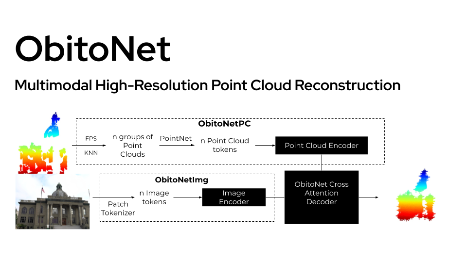

# ObitoNet, [ArXiv](https://arxiv.org/abs/2412.18775)

## Overview

This repository contains the code and approaches for [ObitoNet](https://arxiv.org/abs/2412.18775), a multimodal masked point cloud reconstruction model using a Transformer based approach.
We effectively fuse image features and point cloud features with a Cross-Attention mechanism. Our approach leverages Vision Transformers (ViT) to extract rich semantic features to create input tokens.
A Point Cloud tokenizer generates point cloud tokens utilizing Farthest Point Sampling (FPS) and K-Nearest Neighbors (KNN) and captures local geometric details. 
These multimodal features are combined using a learnable Cross-Attention decoder module, that reconstructs high-fidelity point clouds. 

A link to the video showcasing ObitoNet can be found [here](https://www.youtube.com/watch?v=xC1fuEzKreo).

<p align="center">
  
</p>

## Components
1. **Point Cloud Encoder:** Processes 3D point cloud data into meaningful tokens using Transformers.
2. **Cross Attention Decoder:** Combines encoded data for accurate reconstruction and representation.
3. **Image Encoder:** Planned component for processing 2D image data in conjunction with point clouds.


## Install
PyTorch = 1.7.0 < 1.11.0; python = 3.10; CUDA = 11.8;

```
# Chamfer Distance
cd ./extensions/chamfer_dist
python setup.py install --user

# PointNet++
pip install "git+https://github.com/erikwijmans/Pointnet2_PyTorch.git#egg=pointnet2_ops&subdirectory=pointnet2_ops_lib"

# GPU kNN
pip install --upgrade https://github.com/unlimblue/KNN_CUDA/releases/download/0.2/KNN_CUDA-0.2-py3-none-any.whl
```

## 4. Training
To train ObitoNet, run the following command. There's are a recommended training order. To learn more about training order and other experiments, please refer to our paper.

```
CUDA_VISIBLE_DEVICES=<GPU> python main.py --config configs/config.yaml --exp_name <output_file_name>
```

## Visualization

To visualize the Point Clouds run:

```
python visualization.py --test --config configs/config.yaml--exp_name <name>
```

## Training (Nexus Cluster - UMD)
To run the terminal interactively:
```bash
bash-4.4$ srun --gres=gpu:rtxa5000:4 --account=class --partition=class --qos high -t 1-00:00:00 --mem-per-cpu=64gb --pty bash -i
```

### Dataset Prep 

The model was developed using a modified version Tanks and Temples dataset ([link](https://www.tanksandtemples.org/)). 
We are hosting our modified dataset generated for this particular model here. This uses sampling to generate a set of fixed size point clouds to train the model. THe process is documented in the [Dataloader.ipynb](https://github.com/vinay-lanka/ObitoNet/blob/master/experiments/dataloader.ipynb)
For uniform downsampling, I used different k_values for different data-subsets, as some values were giving us samples less than 16k (less than fps output)
k = 100 (for all)
k = 20 (for caterpillar)